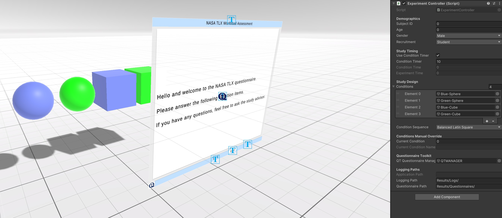

# Mixed Reality Lab Experiments

The provided repository contains a `Unity` project (Unity 2022.2.12f1) for controlling experiments in a virtual environment (VR and Desktop) and for presenting questionnaires after different conditions.

The Unity project includes a management of conditions, demographics, experimental timing, and data logging. The `ExperimentController` class defines enums to manage sequences for experiment conditions (`SequenceOptions`), participant gender (`GenderOptions`), and recruitment methods (`RecruitmentOption`). Demographic information and study timing can be set through the Unity Inspector due to the serialized fields.  

The `ExperimentController` has functionality to handle the order of conditions with methods for balanced Latin square, simple Latin square, permutations, and shuffles (both with and without a seed). The conditions themselves are `GameObject` arrays, which represent different stages or tasks within the experiment. The controller also integrates with the `QuestionnaireToolkit` for managing questionnaires within the experiment.
 
The logging is handled using a `StreamWriter`, outputting data like timestamps, subject demographics, and condition details to a CSV file. The `nextCondition()` and `previousCondition()` methods control the flow of the experiment, showing the next or previous condition accordingly, while the `showCondition()` method activates the current condition. The `showQuestionnaire()` method is used to display questionnaires when conditions are met, such as when the timer runs out.

Please note:
- Files (logs and questionnaires) are saved in your local app directory (persistent application path). The path is displayed during runtime.
- Assets\Experiment\Scenes contains the experimental setup in desktop and VR (only Meta Quest/Oculus support)
- Change demographics at the beginning of your experiment
- The current setup has two independent variables (color and shape)
- Conditions are currently only controlled using their visibility
- Questionnaire input works with mouse (Desktop) and with Quest controller or hands (in VR)

 
